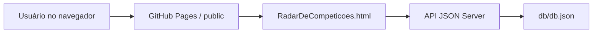

# HUB Da Robótica


Plataforma web acadêmica para centralizar competições, equipes, projetos e contatos do ecossistema brasileiro de robótica.

## Objetivo

O projeto foi desenvolvido como uma plataforma de interface web para apresentar um hub de robótica com navegação institucional, catálogo de competições, favoritos, autenticação didática, detalhes de eventos, gráficos e CRUD administrativo usando JSON Server.

## Principais Funcionalidades

- Página inicial institucional com proposta, público, funcionalidades, missão e objetivos.
- Radar de competições com carrossel, busca, detalhes, favoritos e métricas.
- CRUD de eventos conectado ao JSON Server.
- Login didático com usuários cadastrados no banco JSON.
- Páginas de equipes brasileiras de robótica.
- Garagem de projetos e página de contatos.
- Tema visual responsivo com Tailwind CSS, CSS customizado e Font Awesome.
- Gráfico de distribuição de modalidades com Chart.js.

## Tecnologias Utilizadas

- HTML5
- CSS3
- JavaScript Vanilla
- Tailwind CSS via CDN
- Font Awesome via CDN
- Chart.js via CDN
- Node.js
- JSON Server
- GitHub Pages para hospedagem estática do front-end

## Arquitetura Geral



O front-end fica em `public/` e pode ser publicado como site estático. Os dados ficam em `db/db.json` e são expostos pela API REST do JSON Server em ambiente local ou em um serviço externo compatível com Node.js.

## Estrutura de Pastas

```text
.
├── .github/workflows/        # Workflow de deploy do GitHub Pages
├── db/                       # Banco JSON usado pelo JSON Server
├── docs/                     # Documentação técnica e de deploy
├── public/                   # Interface web estática
│   ├── assets/               # CSS, scripts, imagens e logos
│   └── Equipes/              # Páginas de perfil das equipes
├── scripts/                  # Scripts auxiliares de execução e validação
├── .env.example              # Exemplo de variáveis de ambiente
├── .gitignore                # Regras de versionamento
├── CHANGELOG.md              # Histórico de mudanças
├── CONTRIBUTING.md           # Guia de contribuição
├── LICENSE                   # Licença do projeto
├── package.json              # Scripts npm e dependências
└── README.md                 # Documentação principal
```

## Requisitos de Hardware

Não há hardware obrigatório. Este repositório contém uma plataforma web. Não foram encontrados firmware, pinagem, sensores, atuadores ou dependências de microcontrolador.

## Requisitos de Software

- Node.js 18 ou superior
- npm
- Python 3, usado apenas para servir a pasta `public/` localmente
- Navegador moderno

## Instalação

```bash
npm install
```

## Configuração

O front-end lê a URL da API em:

```text
public/assets/scripts/config.js
```

Configuração local padrão:

```js
window.HUB_ROBOTICA_CONFIG = {
    API_URL: 'http://localhost:3000'
};
```

Para publicar o front-end no GitHub Pages com uma API externa, altere `API_URL` para a URL pública do backend JSON Server.

## Como Executar Localmente

Em um terminal, suba a API:

```bash
npm run api
```

Em outro terminal, suba o site:

```bash
npm run site
```

Acesse:

```text
http://127.0.0.1:8765
```

API local:

```text
http://localhost:3000
```

## Como Usar

1. Abra a página inicial.
2. Acesse "Radar de Competições".
3. Navegue pelos eventos, busque por nome, local ou modalidade e abra os detalhes.
4. Entre com um usuário didático para testar favoritos e CRUD.

Usuários de desenvolvimento cadastrados em `db/db.json`:

```text
admin / 123
user  / 123
```

Essas credenciais são exemplos didáticos e não devem ser usadas como autenticação real em produção.

## Banco de Dados

O banco fica em:

```text
db/db.json
```

Recursos principais:

- `usuarios`: usuários didáticos com login, senha, nome, e-mail, permissão de administrador e favoritos.
- `eventos`: competições exibidas no Radar.

Campos principais de `eventos`:

- `id`
- `nome`
- `tipo`
- `descricao`
- `conteudo`
- `local`
- `data`
- `organizador`
- `destaque`
- `imagemPrincipal`

Mais detalhes: [docs/DATABASE.md](docs/DATABASE.md).

## Interface Web

Páginas principais:

- `public/index.html`: página inicial institucional.
- `public/RadarDeCompeticoes.html`: módulo principal com catálogo, detalhes, favoritos, métricas e CRUD.
- `public/Garagem_De_Projetos.html`: projetos e garagem.
- `public/EquipesBrasil.html`: diretório de equipes.
- `public/Contatos.html`: autoria, instituição e contato.
- `public/Equipes/*.html`: perfis individuais de equipes.

Mais detalhes: [docs/TECHNICAL.md](docs/TECHNICAL.md).

## Publicação

O repositório inclui um workflow para publicar `public/` no GitHub Pages:

```text
.github/workflows/pages.yml
```

Para o backend, hospede o JSON Server em um serviço externo Node.js e configure a URL pública em `public/assets/scripts/config.js`.

Guia de deploy: [docs/DEPLOYMENT.md](docs/DEPLOYMENT.md).

## Validação

Execute:

```bash
npm run validate
```

O validador confere:

- JSON do banco.
- Campos obrigatórios dos eventos.
- Links e assets internos.
- Caminhos com espaços dentro do repositório.

## Limitações Conhecidas

- Autenticação didática sem criptografia de senha.
- JSON Server não é banco de produção.
- Tailwind, Font Awesome e Chart.js são carregados por CDN.
- O GitHub Pages não executa backend; a API precisa ficar em outro serviço.
- CRUD online depende de backend com armazenamento persistente.

## Roadmap

- Migrar autenticação para backend real.
- Migrar dados para Supabase, PostgreSQL ou outro banco gerenciado.
- Criar testes automatizados de UI.
- Adicionar páginas legais reais para privacidade, termos e licença.
- Otimizar imagens grandes para reduzir o peso do repositório.
- Padronizar nomes de páginas para lowercase/kebab-case em uma futura versão com redirects.

## Autor

Cláudio Francisco dos Santos Junior  
Projeto acadêmico de Desenvolvimento de Interfaces Web - PUC Minas.

## Licença

Distribuído sob a licença MIT. Consulte [LICENSE](LICENSE).
