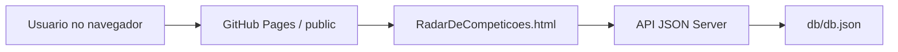

# HUB Da Robotica


Plataforma web academica para centralizar competicoes, equipes, projetos e contatos do ecossistema brasileiro de robotica.

## Objetivo

O projeto foi desenvolvido como uma plataforma de interface web para apresentar um hub de robotica com navegacao institucional, catalogo de competicoes, favoritos, autenticacao didatica, detalhes de eventos, graficos e CRUD administrativo usando JSON Server.

## Principais Funcionalidades

- Pagina inicial institucional com proposta, publico, funcionalidades, missao e objetivos.
- Radar de competicoes com carrossel, busca, detalhes, favoritos e metricas.
- CRUD de eventos conectado ao JSON Server.
- Login didatico com usuarios cadastrados no banco JSON.
- Paginas de equipes brasileiras de robotica.
- Garagem de projetos e pagina de contatos.
- Tema visual responsivo com Tailwind CSS, CSS customizado e Font Awesome.
- Grafico de distribuicao de modalidades com Chart.js.

## Tecnologias Utilizadas

- HTML5
- CSS3
- JavaScript Vanilla
- Tailwind CSS via CDN
- Font Awesome via CDN
- Chart.js via CDN
- Node.js
- JSON Server
- GitHub Pages para hospedagem estatica do front-end

## Arquitetura Geral



O front-end fica em `public/` e pode ser publicado como site estatico. Os dados ficam em `db/db.json` e sao expostos pela API REST do JSON Server em ambiente local ou em um servico externo compativel com Node.js.

## Estrutura de Pastas

```text
.
├── .github/workflows/        # Workflow de deploy do GitHub Pages
├── db/                       # Banco JSON usado pelo JSON Server
├── docs/                     # Documentacao tecnica e de deploy
├── public/                   # Interface web estatica
│   ├── assets/               # CSS, scripts, imagens e logos
│   └── Equipes/              # Paginas de perfil das equipes
├── scripts/                  # Scripts auxiliares de execucao e validacao
├── .env.example              # Exemplo de variaveis de ambiente
├── .gitignore                # Regras de versionamento
├── CHANGELOG.md              # Historico de mudancas
├── CONTRIBUTING.md           # Guia de contribuicao
├── LICENSE                   # Licenca do projeto
├── package.json              # Scripts npm e dependencias
└── README.md                 # Documentacao principal
```

## Requisitos de Hardware

Nao ha hardware obrigatorio. Este repositorio contem uma plataforma web. Nao foram encontrados firmware, pinagem, sensores, atuadores ou dependencias de microcontrolador.

## Requisitos de Software

- Node.js 18 ou superior
- npm
- Python 3, usado apenas para servir a pasta `public/` localmente
- Navegador moderno

## Instalacao

```bash
npm install
```

## Configuracao

O front-end le a URL da API em:

```text
public/assets/scripts/config.js
```

Configuracao local padrao:

```js
window.HUB_ROBOTICA_CONFIG = {
    API_URL: 'http://localhost:3000'
};
```

Para publicar o front no GitHub Pages com uma API externa, altere `API_URL` para a URL publica do backend JSON Server.

## Como Executar Localmente

Em um terminal, suba a API:

```bash
npm run api
```

Em outro terminal, suba o site:

```bash
npm run site
```

Acesse:

```text
http://127.0.0.1:8765
```

API local:

```text
http://localhost:3000
```

## Como Usar

1. Abra a pagina inicial.
2. Acesse "Radar de Competicoes".
3. Navegue pelos eventos, busque por nome/local/modalidade e abra os detalhes.
4. Entre com um usuario didatico para testar favoritos e CRUD.

Usuarios de desenvolvimento cadastrados em `db/db.json`:

```text
admin / 123
user  / 123
```

Essas credenciais sao exemplos didaticos e nao devem ser usadas como autenticacao real em producao.

## Banco de Dados

O banco fica em:

```text
db/db.json
```

Recursos principais:

- `usuarios`: usuarios didaticos com login, senha, nome, email, permissao admin e favoritos.
- `eventos`: competicoes exibidas no Radar.

Campos principais de `eventos`:

- `id`
- `nome`
- `tipo`
- `descricao`
- `conteudo`
- `local`
- `data`
- `organizador`
- `destaque`
- `imagemPrincipal`

Mais detalhes: [docs/DATABASE.md](docs/DATABASE.md).

## Interface Web

Paginas principais:

- `public/index.html`: pagina inicial institucional.
- `public/RadarDeCompeticoes.html`: modulo principal com catalogo, detalhes, favoritos, metricas e CRUD.
- `public/Garagem_De_Projetos.html`: projetos e garagem.
- `public/EquipesBrasil.html`: diretorio de equipes.
- `public/Contatos.html`: autoria, instituicao e contato.
- `public/Equipes/*.html`: perfis individuais de equipes.

Mais detalhes: [docs/TECHNICAL.md](docs/TECHNICAL.md).

## Publicacao

O repositorio inclui um workflow para publicar `public/` no GitHub Pages:

```text
.github/workflows/pages.yml
```

Para o backend, hospede o JSON Server em um servico externo Node.js e configure a URL publica em `public/assets/scripts/config.js`.

Guia de deploy: [docs/DEPLOYMENT.md](docs/DEPLOYMENT.md).

## Validacao

Execute:

```bash
npm run validate
```

O validador confere:

- JSON do banco.
- Campos obrigatorios dos eventos.
- Links e assets internos.
- Caminhos com espacos dentro do repositorio.

## Limitacoes Conhecidas

- Autenticacao didatica sem criptografia de senha.
- JSON Server nao e banco de producao.
- Tailwind, Font Awesome e Chart.js sao carregados por CDN.
- O GitHub Pages nao executa backend; a API precisa ficar em outro servico.
- CRUD online depende de backend com armazenamento persistente.

## Roadmap

- Migrar autenticacao para backend real.
- Migrar dados para Supabase, PostgreSQL ou outro banco gerenciado.
- Criar testes automatizados de UI.
- Adicionar paginas legais reais para privacidade, termos e licenca.
- Otimizar imagens grandes para reduzir peso do repositorio.
- Padronizar nomes de paginas para lowercase/kebab-case em uma futura versao com redirects.

## Autor

Claudio Francisco dos Santos Junior  
Projeto academico de Desenvolvimento de Interfaces Web - PUC Minas.

## Licenca

Distribuido sob a licenca MIT. Consulte [LICENSE](LICENSE).
# HUB_Da_Robotica
